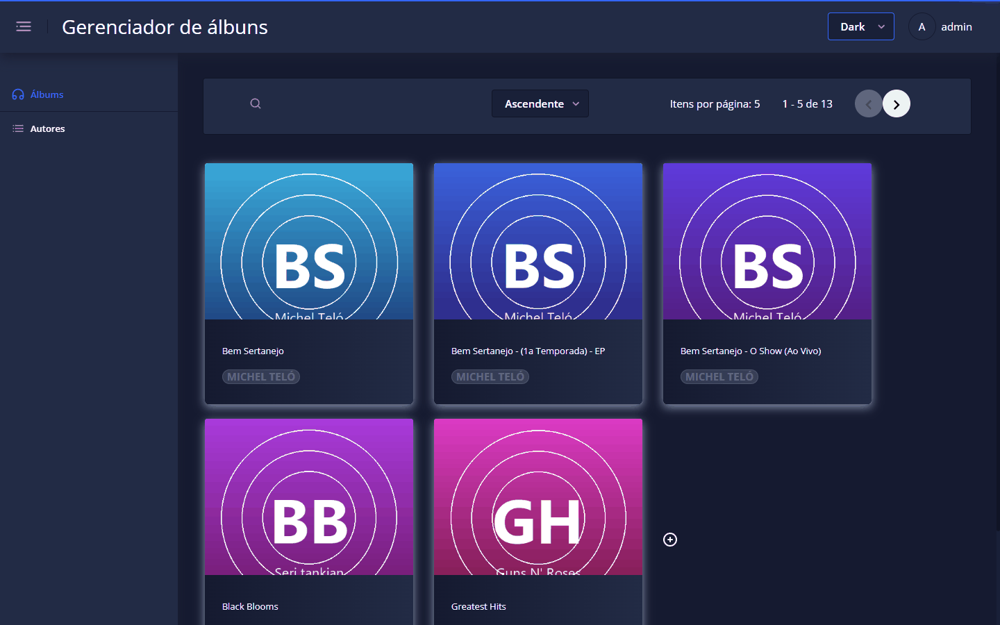
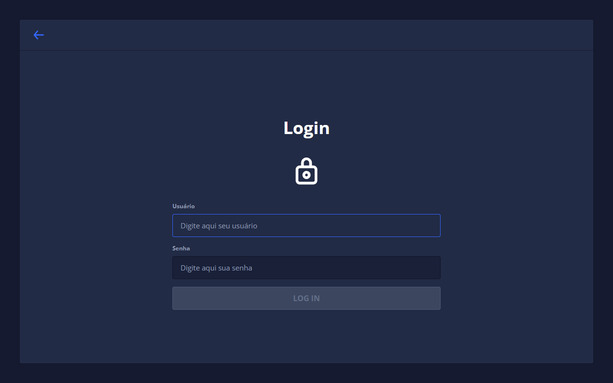
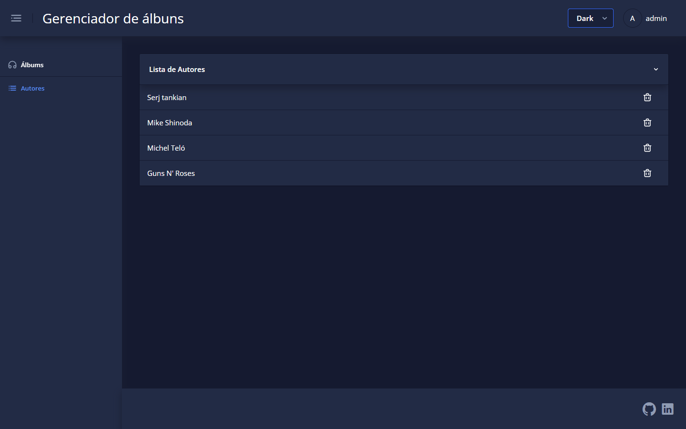
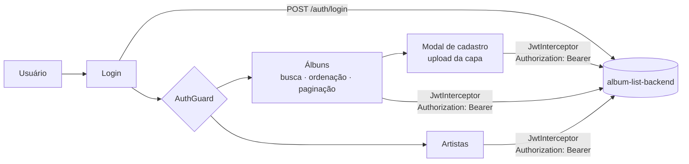

<div align="center">

# album-list-frontend

**Interface em Angular para gerenciar álbuns e artistas, com login JWT e upload de capas.**

[](https://angular.io/)
[](https://www.typescriptlang.org/)
[](https://akveo.github.io/nebular/)
[](https://rxjs.dev/)
[](#com-docker)

[Telas](#telas) · [Como rodar](#como-rodar) · [Estrutura](#estrutura) · [Back-end](https://github.com/ronnyarruda20/album-list-backend)



</div>

## Sobre

Front-end do **Album List**, uma aplicação full-stack de 2021. Consome a API do [album-list-backend](https://github.com/ronnyarruda20/album-list-backend), feita em Spring Boot.

- Login com JWT. O token fica no `localStorage`, vai em toda requisição por um interceptor e é renovado automaticamente antes de expirar.
- Rotas protegidas por guard. Um segundo interceptor trata erros de autenticação e devolve o usuário ao login.
- Lista de álbuns em cards com capa, busca por nome, ordenação ascendente ou descendente e paginação.
- Skeleton de carregamento (ghost loading) enquanto a lista chega.
- Cadastro de álbum em modal, com upload da capa convertida para base64.
- Lista de artistas com remoção e confirmação em diálogo.
- Três temas do Nebular (Light, Dark e Cosmic), trocados pelo seletor do cabeçalho.

## Telas

| Login | Artistas |
|---|---|
|  |  |

## Como funciona



## Como rodar

O back-end precisa estar no ar em `http://localhost:8080`. O endereço fica em `src/environments/environment.ts`.

Pré-requisito: Node.js 12 ou 14. O projeto usa `node-sass` 4, que não compila em versões mais novas.

```bash
git clone https://github.com/ronnyarruda20/album-list-frontend.git
cd album-list-frontend
npm install
npm start
```

Acesse <http://localhost:4200> com o usuário `admin` e a senha `password`.

<details>
<summary>Rodando com Node 16</summary>

O Angular 10 compila o Sass com o pacote `sass` quando o `node-sass` não está presente. Basta pular o build nativo e remover o pacote:

```bash
npm install --legacy-peer-deps --ignore-scripts
rm -rf node_modules/node-sass
npm start
```

</details>

### Com Docker

O `Dockerfile` faz o build com Node 12 e serve o resultado com nginx.

```bash
docker build -t album-list-frontend .
docker run --name album-list -d -p 4200:80 album-list-frontend
```

## Scripts

| Comando | O que faz |
|---|---|
| `npm start` | Servidor de desenvolvimento em `localhost:4200` |
| `npm run build` | Build de desenvolvimento em `dist/` |
| `npm run build:prod` | Build de produção com AOT |

## Estrutura

```
src/app/
├── @core/          serviços de layout, SEO e estado
├── @theme/         cabeçalho, rodapé, layouts, pipes e temas do Nebular
├── pages/
│   ├── album/      lista, card, modal de cadastro e serviço de álbuns
│   └── autor/      lista e serviço de artistas
├── security/
│   ├── auth/       login e logout
│   ├── guards/     proteção de rotas
│   ├── helpers/    interceptors de JWT e de erro, inicialização da sessão
│   └── service/    autenticação e renovação do token
└── shared/         diálogo de remoção, paginação e traduções
```

## Créditos

O layout parte do [ngx-admin](https://github.com/akveo/ngx-admin) 6.0, da Akveo, distribuído sob a licença MIT. As telas de álbuns, artistas e autenticação foram escritas para este projeto.

---

<div align="center">
<sub>Feito por <a href="https://github.com/ronnyarruda20">Ronny Arruda</a> · <a href="https://ronnyarruda20.github.io">ronnyarruda20.github.io</a></sub>
</div>
